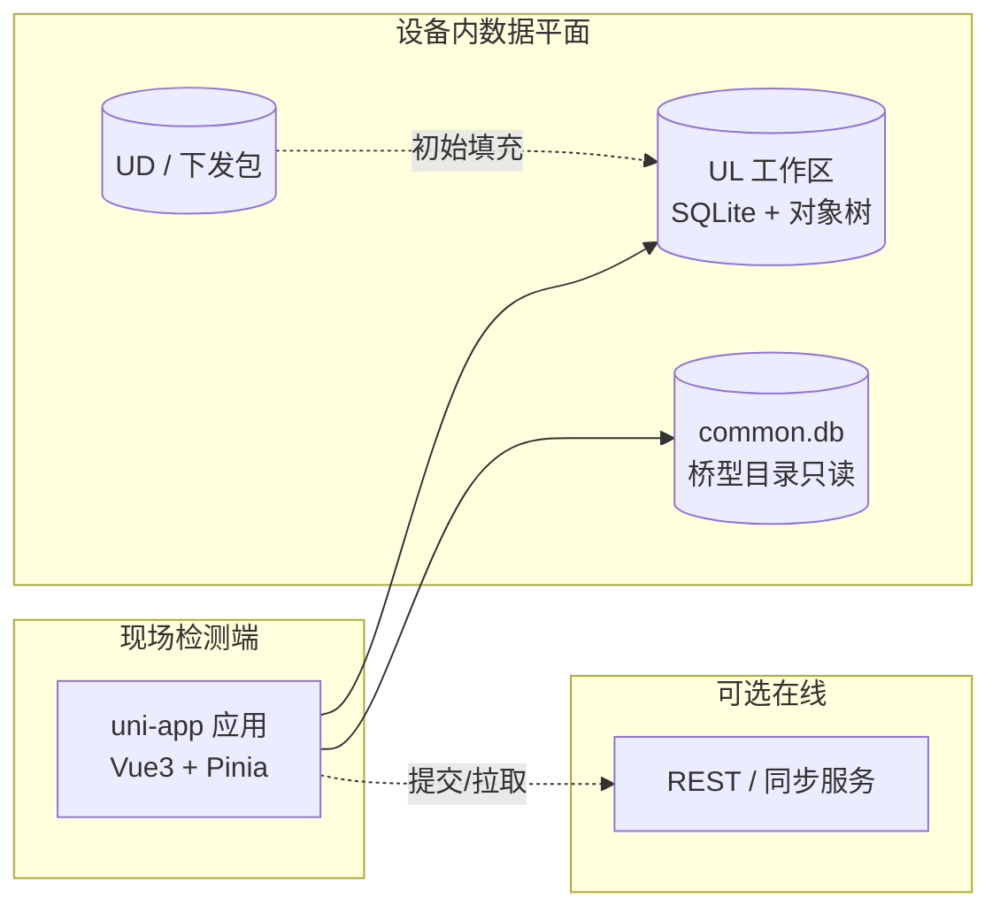
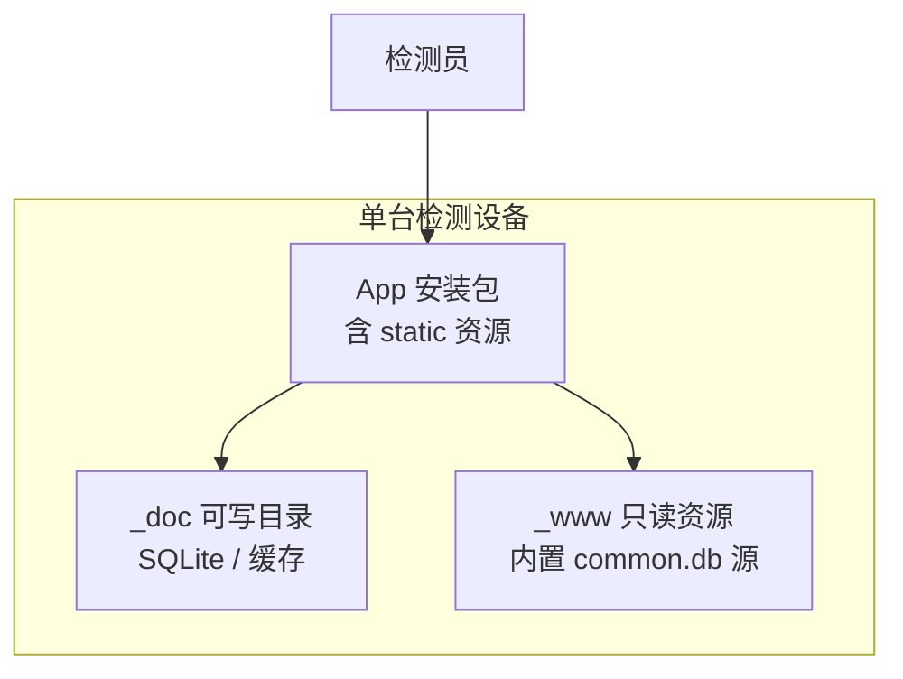

# 桥梁检测前端（BuildingInspector）— 离线优先移动端生态架构

**文档类型**：USP 级生态与部署架构（Eco-Arch）  
**范围**：本仓库（uni-app 客户端）+ 与之衔接的本地数据与目录资源；不含后端业务服务细节。  
**版本**：0.1（草案）

---

## 1. 一句话定位

在弱网/无网环境下，检测员使用 **Android/iOS App（uni-app）** 完成桥梁病害与结构信息采集；数据以 **本地 SQLite + 工作区文件** 为权威副本，桥型与病害量纲来自 **内置只读目录库（common.db）**，与可选的在线同步形成 **「离线主写、在线辅同步」** 的移动生态。

---

## 2. 生态角色与边界

| 角色 | 职责 | 典型形态 |
|------|------|-----------|
| **检测终端（本 App）** | 表单、照片、结构树、多跨切换、本地持久化 | uni-app → App-Plus |
| **本地工作数据（UL）** | 当前桥梁检测会话的可变数据 | `data.db` / object 树 / 病害 JSON 等 |
| **下发/归档数据（UD）** | 初始包、历史快照、只读参考 | 用户库 SQLite / 包内资源 |
| **桥型目录库** | 标准构件树、病害类型、量纲列 | `_doc`/`_www` 下的 `common.db` |
| **在线能力（可选）** | 提交、拉取、在线资料 | HTTPS API（`config/api.js` 等） |

**生态边界**：本仓库主要交付 **终端 + 本地数据契约**；服务端若存在，在生态图中视为 **「同步与只读查询的可选 peer」**，不绑定具体厂商实现。

---

## 3. 逻辑架构（Eco-Arch）

**数据流原则**

1. **写路径默认落 UL**，再按需同步到服务端。  
2. **读桥型/模板** 只走目录库，避免把 catalog 写进业务库。  
3. **多跨** 在对象层用 `bridgeSpanSetupBySpan` 等与 UI pills 对齐，避免仅靠顶层字段表达多跨语义。

---

## 4. 部署与运行拓扑（移动端）

- **首次启动**：将包内 `static/sqlite/common.db` 复制/迁移到 `_doc`，版本键控制升级（见 `bridgeCatalogDb.js`）。  
- **按项目/桥梁**：UL 与 `buildingId` 绑定，避免跨项目污染。

---

## 5. 与「纯 Web」生态的对比（本 USP 的差异）

| 维度 | 典型 Web 检测后台 | 本 USP（移动离线生态） |
|------|-------------------|------------------------|
| 权威存储 | 服务端 DB | 设备端 UL + SQLite |
| 桥型/量纲 | 远程配置中心 | 内置 `common.db` + 运行时迁移 |
| 冲突解决 | 服务端合并 | 需客户端策略 + 提交幂等 |
| 合规与审计 | 集中日志 | 设备本地 + 上传后服务端（若接） |

---

## 6. 非功能与演进（生态级）

- **可替换性**：目录库、API 基址、存储路径通过配置与版本标志切换，避免硬编码环境。  
- **可观测性**：关键路径（catalog 打开、UL 写入失败）需用户可感知 Toast + 可导出日志（后续可增强）。  
- **安全**：本地文件路径、动态 SQL 需防路径穿越与注入；敏感凭据不进仓库。

---

## 7. 文档维护

- 若数据契约或 `common.db` 表结构有重大变更，应同步更新本节与 `bridgeCatalogDb` 内版本常量说明。  
- 若引入正式后端同步协议，建议增补「同步状态机」小节（未纳入本草案）。
